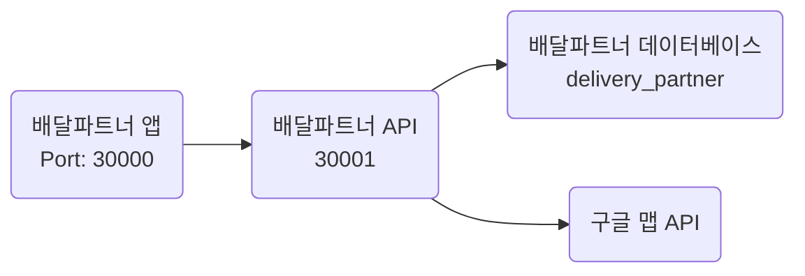

# 프로젝트
배달 파트너 앱 서비스

# 준비사항
- 배달 파트너 API
- 배달 파트너 데이터베이스: delivery_partner
- 구글 맵 API Key

# 프로젝트 실행 정보
- 서버 Port: 30000
## Run Configuration
### VM Option
```
-Dgoogle.map.key=[구글 맵 Key]
```

# 프로젝트 구성
